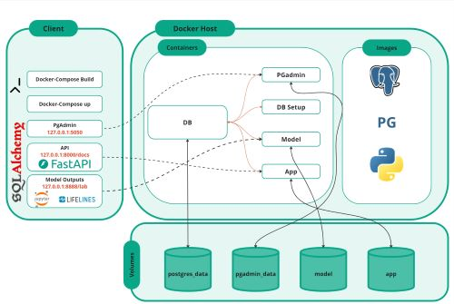

# Customer Retention through an API-Driven Survival Analysis within a Microservice Architecture For A Loan Company


## Description

This project aims to set up a Dockerized environment for PostgreSQL database, pgAdmin for database management, a model container, and an API container. It provides a convenient way to develop, deploy, and manage these components within a single Docker Compose configuration. The overall structure of the project is pictured below!



## Prerequisites

Before getting started, ensure you have the following prerequisites installed:

- Docker: [Install Docker](https://docs.docker.com/get-docker/)
- Docker Compose: [Install Docker Compose](https://docs.docker.com/compose/install/)

## Installation

1. Clone the repository:
   ```bash
   git clone https://github.com/anmanasyan/DS299-Capstone
   ```
2. Navigate to the survival_pipeline folder in the project directory:
   ```bash
   cd <project_directory/survival_pipeline>
   ```

3. Build and start the Docker containers:
   ```bash
   docker-compose up --build
   ```

## Usage

- Access pgAdmin for PostgreSQL management: [http://localhost:5050](http://localhost:5050)
    - username: admin@admin.com 
    - password: admin
    - When running for the first time, you must create a server. Configure it as shown in the below image (Password is blurred it should be `password`.)
    
- Access the API: [http://127.0.0.1:8000/docs](http://127.0.0.1:8000/docs)
- Access modelling: [http://127.0.0.1:8888/lab](http://127.0.0.1:8888/lab)
