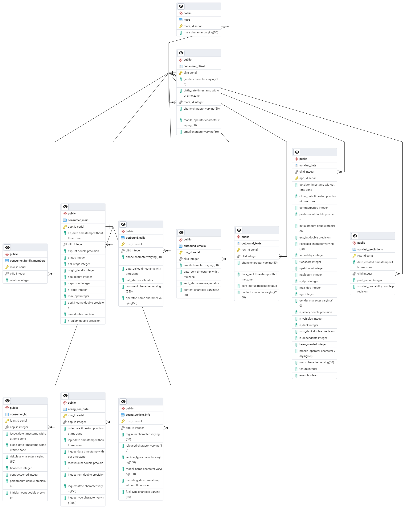

# Database Schema

**Below you can find information about the database schema!**

::: survival_pipeline.db_setup.models

# Pydantic Classes

**Custom Pydantic classes for data validation:**

::: survival_pipeline.db_setup.schema

# ERD

At last the database schema looked like: 

